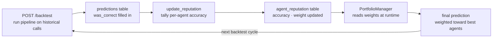

# Architecture Diagram

## Full Data Flow

```mermaid
flowchart TD
    subgraph data["Data Layer"]
        EDGAR["SEC EDGAR API\nfull-text transcript search"]
        YF["yfinance\nhistorical price data"]
    end

    subgraph graph["LangGraph Pipeline — earnings_graph.py"]
        direction TB
        subgraph analysts["Analyst Team (parallel — asyncio.gather)"]
            FA["FundamentalsAnalyst\nrevenue · EPS · margins · guidance"]
            SA["SentimentAnalyst\ntone · hedging · Q&A confidence"]
            TA["TechnicalAnalyst\n5d/30d returns · RSI · volume"]
        end

        subgraph debate["Researcher Team (sequential debate — N rounds)"]
            BR["BullResearcher\nbullish synthesis · rebuttals"]
            BE["BearResearcher\nbearish synthesis · rebuttals"]
            BR <-->|"round 0: analyze()\nrounds 1+: analyze_rebuttal()"| BE
        end

        PM["PortfolioManager\nreads all reports + debate\napplies reputation weights\nfinal direction · confidence · reasoning"]

        analysts --> debate
        debate --> PM
    end

    subgraph db["PostgreSQL — Supabase"]
        T["transcripts"]
        PS["price_snapshots"]
        PR["predictions"]
        AR["agent_reputation"]
    end

    subgraph api["FastAPI — /api/v1"]
        AZ["POST /analyze"]
        BT["POST /backtest"]
        PH["GET /predictions"]
    end

    subgraph fe["Frontend — Next.js"]
        UI["Analysis UI\nticker input · transcript textarea"]
        DV["AgentDebate\nbull vs bear by round"]
        HX["History\npast predictions"]
        BC["Backtest Dashboard\nReputationChart · per-ticker table"]
    end

    EDGAR -->|transcript text| graph
    YF -->|price dict| graph
    T -->|transcript rows| BT
    PS -->|price snapshot rows| BT

    PM --> AZ
    AZ --> PR
    BT --> PR

    PR --> PH
    PR --> AZ

    AZ --> UI
    PH --> HX
    BT --> BC
    PM --> DV
```

## Reputation Feedback Loop



## Agent Output Contracts

| Agent | Input | Output schema |
|---|---|---|
| FundamentalsAnalyst | `{ transcript }` | `{ signal, key_points[], confidence }` |
| SentimentAnalyst | `{ transcript }` | `{ signal, key_points[], confidence }` |
| TechnicalAnalyst | `{ price_data }` | `{ signal, key_points[], confidence }` |
| BullResearcher | `{ fundamentals, sentiment, technical }` | `{ argument, confidence, rebuttals[] }` |
| BearResearcher | `{ fundamentals, sentiment, technical }` | `{ argument, confidence, rebuttals[] }` |
| PortfolioManager | `{ fundamentals, sentiment, technical, debate[] }` | `{ direction, confidence, reasoning, weighted_signals }` |

All agents return raw JSON — no markdown, no prose. Enforced in `BaseAgent._parse_json()`.

## LLM Routing

```
quick_model (haiku / gpt-4o-mini)
    └── FundamentalsAnalyst
    └── SentimentAnalyst
    └── TechnicalAnalyst

deep_model (sonnet / gpt-4o)
    └── BullResearcher  (initial + rebuttals)
    └── BearResearcher  (initial + rebuttals)
    └── PortfolioManager
```

Switching providers requires only changing `LLM_PROVIDER` in `.env` — no agent code changes needed.

## Database Schema

```
transcripts          price_snapshots       agent_reputation
──────────────       ───────────────       ────────────────
id (UUID PK)         id (UUID PK)          id (UUID PK)
ticker               ticker                agent_name
fiscal_quarter       snapshot_date         correct_predictions
filing_date          close_price           total_predictions
transcript_text      price_30d_later       accuracy
edgar_accession_no   actual_direction      weight
created_at                                 updated_at

predictions
───────────
id (UUID PK)
ticker
transcript_id → transcripts.id
run_date
final_direction / final_confidence / final_reasoning
agent_reports (JSONB)
debate_transcript (JSONB)
weighted_signals (JSONB)
actual_direction        ← filled in by backtest runner
was_correct             ← filled in by backtest runner
```
